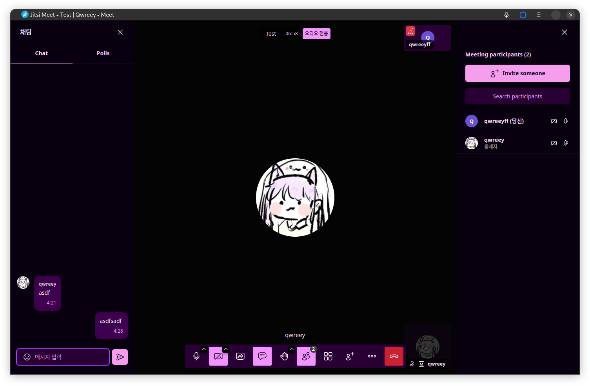

# jitsi meet



> [More images](./preview/gallery.md)

## How to apply

Mount `welcome.html` file to `/usr/share/jitsi-meet/static/welcomePageAdditionalContent.html` to inject html file which includes style and script that modify layout.

In `docker-compose.yml`, try

```yml
services:
  jitsi-web:
    ...
    volumes:
      ...
      - ./welcome.html:/usr/share/jitsi-meet/static/welcomePageAdditionalContent.html
  ...
```
